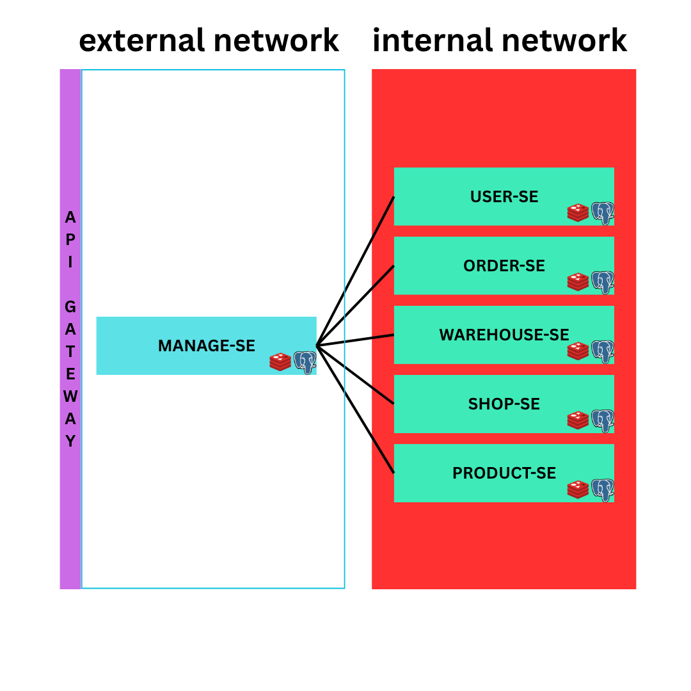

# Case Study - Back End Engineer

This project consists of multiple microservices that work together in a modular architecture. Each service has its own responsibility and can be run independently.

## Overview

- `docker-compose.yaml` is used to run service dependencies such as databases or other infrastructure components.
- The system is divided into **External Services** (accessible by users) and **Internal Services** (only accessible within the internal network by other services).

## Architecture



### Service Classification

- **External Services**:  
  Services exposed to users or external clients.
    - `manage-se`

- **Internal Services**:  
  Services that are only accessible within the service network. These support the external services.
    - `product-se`
    - `warehouse-se`
    - `order-se`
    - `user-se`
    - `shop-se`

---

## How to Run the Services

Make sure dependencies are up and running via `docker-compose up -d` before starting any service.

### ✅ Manage Service 
```bash
cd manage-se
go run main.go db:migrate up
go run main.go http
```


### ✅ User Service
```bash
cd user-se
go run main.go db:migrate up
go run main.go http
```

### ✅ Product Service
```bash
cd product-se
go run main.go db:migrate up
go run main.go http
```

### ✅ Warehouse Service
```bash
cd warehouse-se
go run main.go db:migrate up
go run main.go http
```

### ✅ Shop Service
```bash
cd shop-se
go run main.go db:migrate up
go run main.go http
```

### ✅ Order Service
```bash
cd order-se
go run main.go db:migrate up
go run main.go http
```